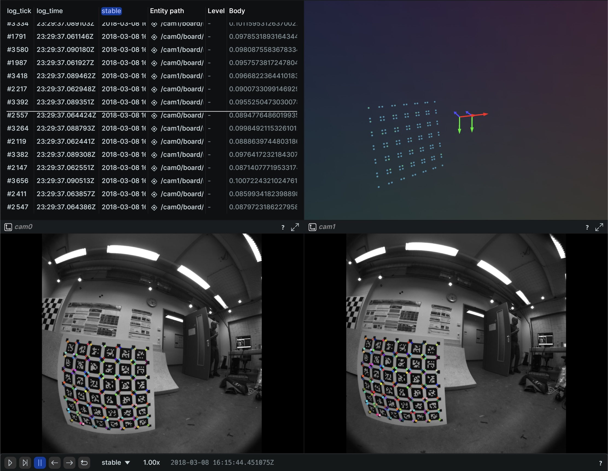

# camera-intrinsic-calibration
[](https://crates.io/crates/camera-intrinsic-calibration)
[](https://crates.io/crates/camera-intrinsic-calibration)

[](https://pypi.org/project/camera-intrinsic-calibration)
[](https://pypi.org/project/camera-intrinsic-calibration)

A pure rust camera intrinsic calibration tool.

## Installation
```sh
# cargo install cli
cargo install camera-intrinsic-calibration
# Or pip install cli
pip install camera-intrinsic-calibration
```
Or download from the latest [release](https://github.com/powei-lin/camera-intrinsic-calibration-rs/releases).

## CLI Usage
```sh
# camera-calibration-rs
ccrs -h

# run intrinsic calibration on TUM vi dataset
# Download and untar
wget https://vision.in.tum.de/tumvi/exported/euroc/1024_16/dataset-calib-cam1_1024_16.tar
tar xf dataset-calib-cam1_1024_16.tar

# [Optional] export RUST_LOG=trace
ccrs dataset-calib-cam1_1024_16 --model eucm

```
### Visualize details after calibration
```sh
# use cargo to install rerun
cargo install rerun-cli --version 0.23.2
# or use pip to install rerun
pip install rerun-sdk==0.23.2
# visualize result
rerun results/20YYMMDD_HH_MM_SS/logging.rrd
```


## Supported formats
### Dataset format
* Euroc (default)
    ```
    dataset_root
    └── mav0
        ├── cam0
        │   └── data
        │       ├── {time_stamp}.png
        │       ├── {time_stamp}.png
        │       └── {time_stamp}.png
        └── cam1
            └── data
                ├── {time_stamp}.png
                ├── {time_stamp}.png
                └── {time_stamp}.png
    ```
* General `--dataset-format general`
    ```
    dataset_root
    ├── cam0
    │   ├── any_file_name.png
    │   ├── any_file_name.png
    │   └── any_file_name.png
    └── cam1
        ├── any_file_name.png
        ├── any_file_name.png
        └── any_file_name.png
    ```
    Images can be either `.png` or `.jpg`, but `.png` is preferred if possible. PNG is lossless compression, while JPG is not.
### Camera models
* Extended Unified (EUCM)
* Extended Unified with Tangential (EUCMT)
* Unified Camera Model (UCM)
* Kannala Brandt (KB4) aka OpenCV Fisheye
* OpenCV (OPENCV5) aka `plumb_bob` in ROS
* F-theta (FTHETA) by NVidia

## Examples
```sh
cargo run -r --example convert_model
```

## Calibrate your own camera
Please follow the [tutorial](docs/tutorial.md).

## Acknowledgements
Links:
* https://cvg.cit.tum.de/data/datasets/visual-inertial-dataset
* https://github.com/itt-ustutt/num-dual
* https://github.com/sarah-quinones/faer-rs

Papers:

* Kukelova, Zuzana, et al. "Radial distortion homography." Proceedings of the IEEE conference on computer vision and pattern recognition. 2015.

### TODO
* [x] Multi-camera extrinsic
* [x] More calibration info