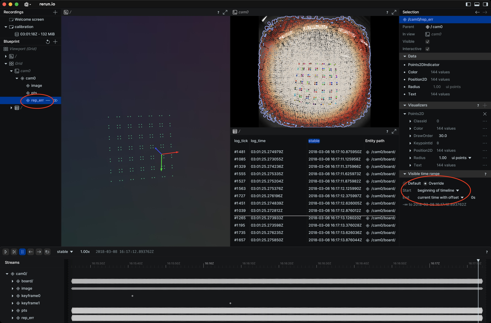
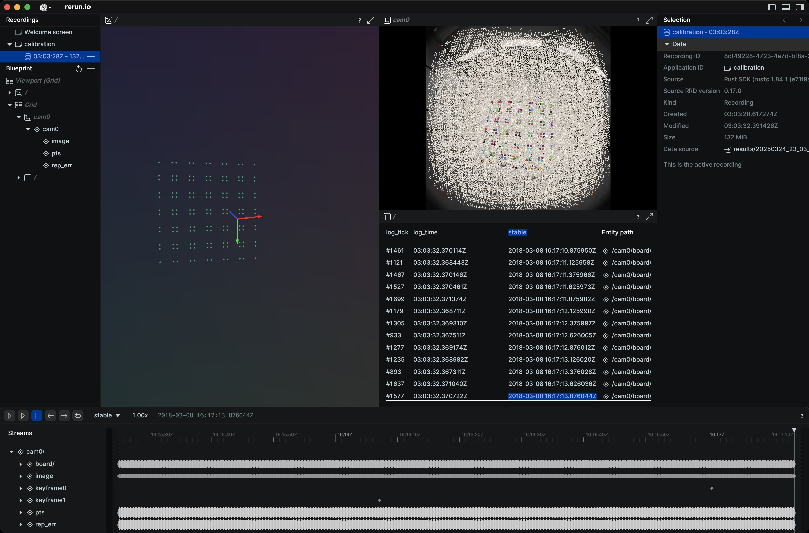

# Before Calibration
1. What kind of camera are you calibrating?
    * **Global shutter camera** -> You can record a video and convert it to images, or take photos.
    * **Rolling shutter camera** -> Make sure you only take photos while the camera is static.
2. Print a custom board and get the board configuration JSON. See the [Generate Chart PDF section](https://github.com/powei-lin/aprilgrid-rs?tab=readme-ov-file#generate-chart-pdf). If you don't care about camera-to-camera extrinsic parameters, you can print the board in any size. **MAKE SURE THE BOARD IS FLAT!**
3. Ensure that the folder structure follows the [supported dataset format](https://github.com/powei-lin/camera-intrinsic-calibration-rs?tab=readme-ov-file#dataset-format).

# Run Calibration
1. What camera model should I use?
    * **Wide FoV camera** -> `kb4` or `eucm`
    * **Other models** -> `opencv5`
    * If you know of other models, you probably don't need my recommendation.
    * My favorite -> **EUCMT**
2. Use `rerun` to analyze the result. You can click `rep_err` and adjust the visible time range from the beginning to see the accumulated reprojection errors.

    For example, using the `kb4` model with only two distortion parameters. This shows that the edges have higher errors:
    
    
    Use the `kb4` model with four distortion parameters:
    

# Calibration Tips
* If two distortion parameters are enough, don't use more. Using more distortion parameters can cause overfitting.
* `--one-focal` is highly recommended.
* Make sure your dataset covers multiple angles and distances, like the example dataset.